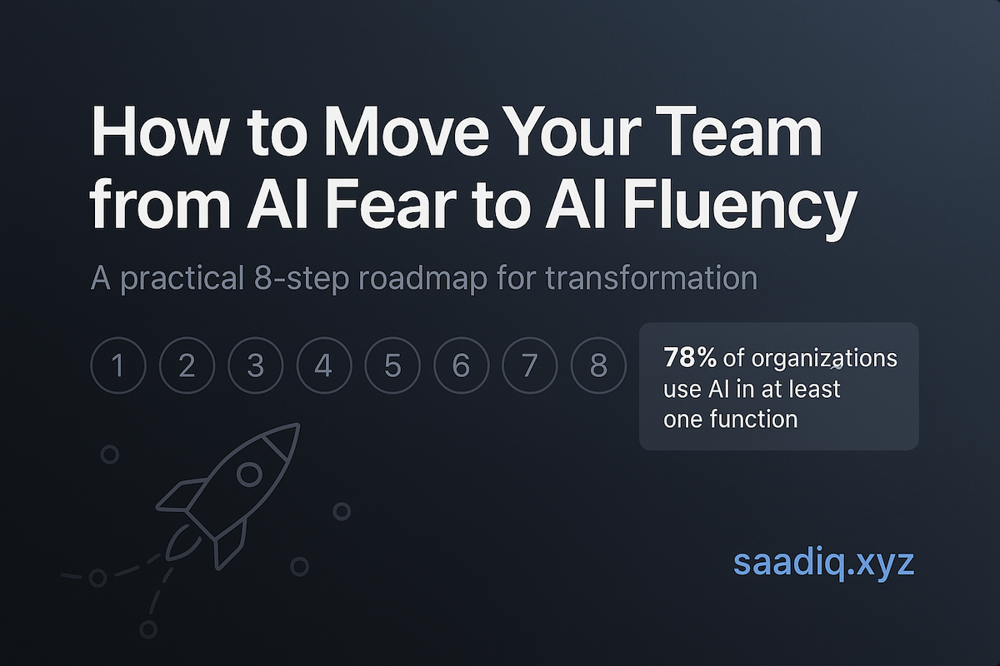

# How to Move Your Team from AI Fear to AI Fluency

A practical 8-step roadmap to transform your organization from AI anxiety to AI mastery. With 78% of organizations now using AI in at least one function, this framework helps guide your team through successful adoption.

## 🚀 View the Interactive Framework

**[👉 Visit the Live Site](https://saadiq.github.io/organizational-ai-adoption/)**

## 📋 The 8-Step Framework

1. **Set Clear Goals** - You can't craft a plan without knowing your destination
2. **Create a Data Policy** - Establish guardrails that address employee anxieties about AI use
3. **Leadership Models the Way** - Teams follow what leadership demonstrates, not what they announce
4. **Identify Department Champions** - Find AI enthusiasts who understand both technology and your processes
5. **Create "Aha Moments"** - Help everyone experience AI's real value in their daily work
6. **Build Knowledge Sharing Systems** - Scale individual AI discoveries into organization-wide practices
7. **Automate Key Processes** - Identify repetitive workflows and implement AI-powered solutions
8. **Build AI-Native Products** - Integrate AI capabilities into new and existing offerings

## 💡 About

This interactive infographic provides a comprehensive roadmap for organizations looking to successfully adopt AI technologies while addressing common fears and resistance to change.

## 🔗 Connect

- **Website**: [saadiq.xyz](https://saadiq.xyz)
- **LinkedIn**: [linkedin.com/in/saadiq](https://www.linkedin.com/in/saadiq/)
- **Book a Consultation**: [cal.com/saadiq/free-ai-consultation](https://cal.com/saadiq/free-ai-consultation)

---

*Transform your team from AI fear to AI fluency with expert guidance and practical implementation strategies.* 